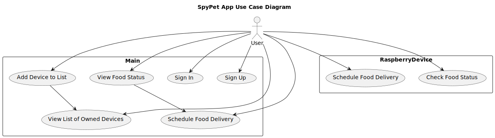
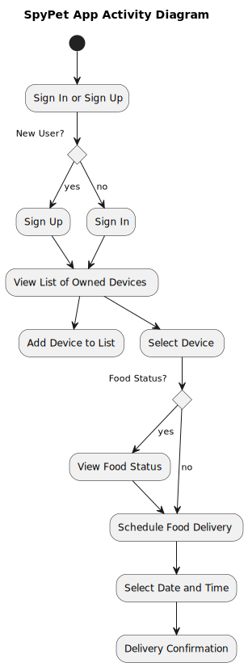
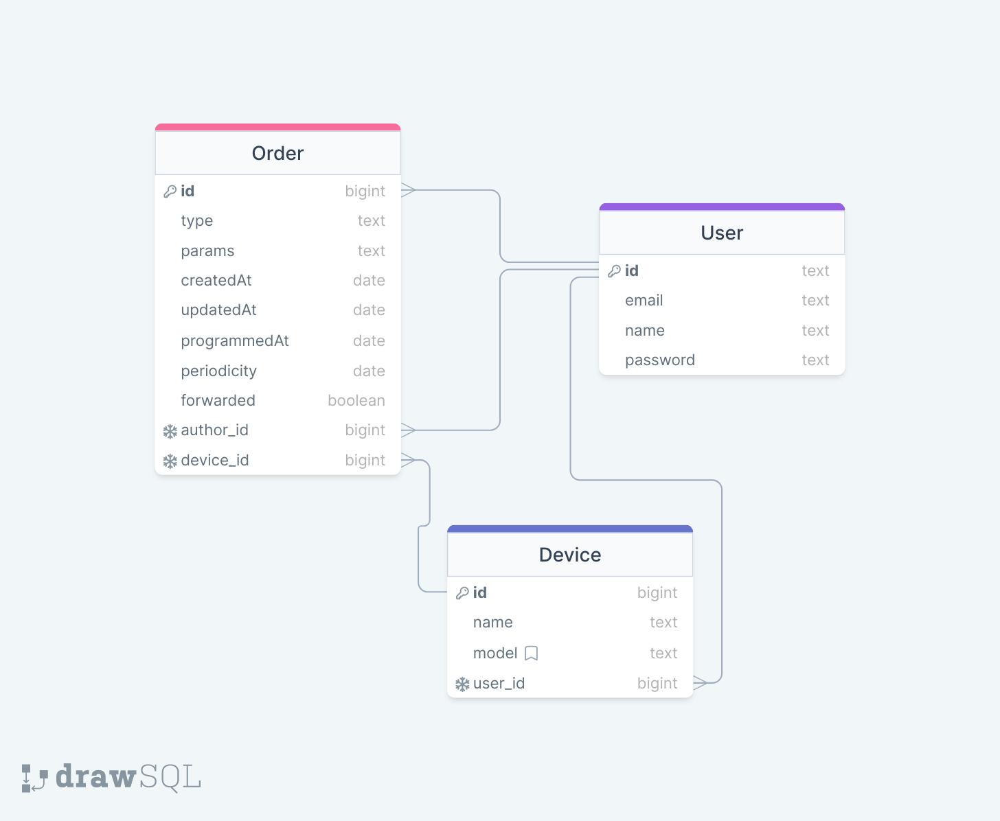

# PROJECT-Spypet

This project will help you feed your pet using your phone. 

You can plan its meals from time to the quantity and even track how much it eats.

# Documentation

## UML

## User Case Diagram



## Activity Diagram




#
## Server

Built with : TS, express

The server is the main interface between the mobile app and the raspberry.

The server and the database are seperate containers that communicate with eachother.


### Endpoints: 

 Get the list of orders 
````
GET: /orders
````

 Add new order (should be authentificated)
````
POST: /orders
````


 Signup
````
POST: /signup
````

Signin
````
POST: /signin
````


Check if device is registered
````
GET: /registeredDevice
````

Register device
````
POST: /registeredDevice
````

### ServerSocket

Establishes a connection with the raspberry. 
The server listens to events emitted by the raspberry.

Checkout [events.yaml](/designs/architecture/events.yaml)

#
## Database

The data base is powered by postgresql




